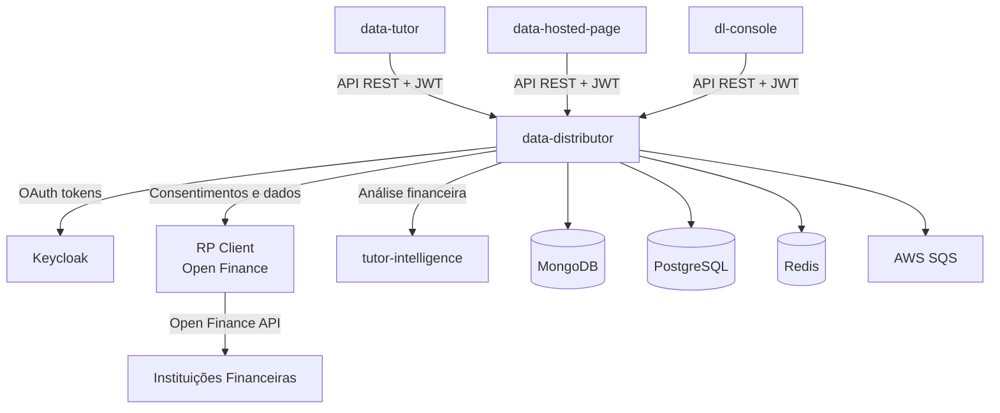

 

## Posição na Arquitetura

```mermaid
graph TB
    DT[data-tutor]
    DHP[data-hosted-page]
    DLC[dl-console]

    DD[data-distributor]

    KC[Keycloak]
    RP[RP Client\nOpen Finance]
    TI[tutor-intelligence]
    MDB[(MongoDB)]
    PG[(PostgreSQL)]
    RD[(Redis)]
    SQS[AWS SQS]
    OF[Instituições Financeiras]

    DT & DHP & DLC -->|API REST + JWT| DD

    DD -->|OAuth tokens| KC
    DD -->|Consentimentos e dados| RP
    RP -->|Open Finance API| OF
    DD -->|Análise financeira| TI
    DD --> MDB
    DD --> PG
    DD --> RD
    DD --> SQS
```
